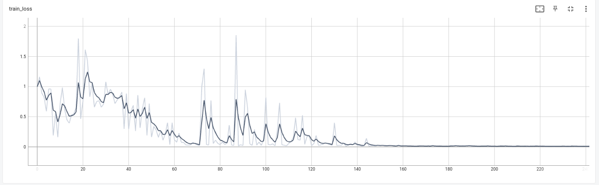
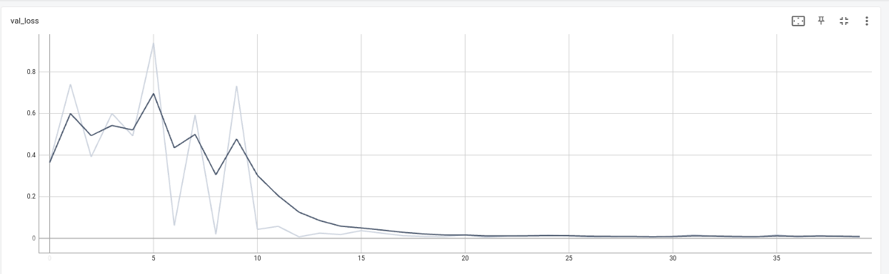
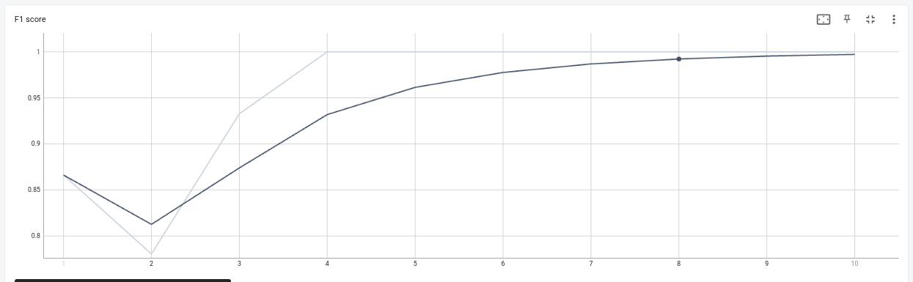
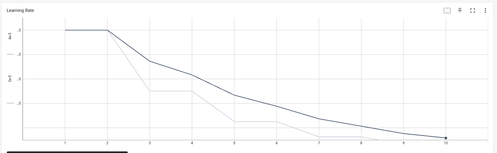

# Document Classification with LayoutLMv3

The dataset used for training is provided [here](https://www.kaggle.com/datasets/ritvik1909/document-classification-dataset)

- Since the dataset only contains 165 images training a large model like LayoutLMv3 from scratch is not feasible. Transfer learning is used to finetune the model on the current dataset.
- Another issue faced was that model would overfit very quickly within a few epochs. To address this issue I've emplyed learning rate dacay of 0.5 after every two epochs.
- Training is not stable for batch-size lower than 4 likely because of batch norm function.


From the figures below we can see the trainiing progress and evidently model does not overfit:
- Training loss decreases consistantly:

- Validation loss does not increase because of low learning rate:

- F1-score incresase remains 1 because all samples are classified correctly:

- Learning rate is halved every 2 epochs:



## Setting up training:
- Use the ```environment.yml``` file to create a conda environmnet.
- Training configs are given in ```config.yaml```
- Logging configs can be set in ```logging.conf```
- Train by simply running ```python train.py```

## Running Inference:

### Build docker:
- Download the pretrained weights file from [here](https://drive.google.com/file/d/1lWOLVfrt78DDkMwcz8THfD9gv8ejBaHk/view?usp=sharing) OR use locally trained weights file and place it in ```./weights``` folder.
- Download the dataset from the [link](https://www.kaggle.com/datasets/ritvik1909/document-classification-dataset) and extract it in ```./images_dir```
- Build the docker with Dockerfile using: ```docker build -t dl_assignment_px_noman .```
- Run the docker file with ```docker run -v full_path/to_local_dir:/home/app/images_dir -e IMG_PATH=images_dir/resume/doc_000070.png dl_assignment_px_noman```

### Pull from dockerhub:
- Pull the docker from dockerhub ```docker pull nomantanveer/dl_assignment_px_noman:latest```
- Run the docker file with ```docker run -e IMG_PATH=<./images_dir/resume/doc_000051.png> dl_assignment_px_noman```
